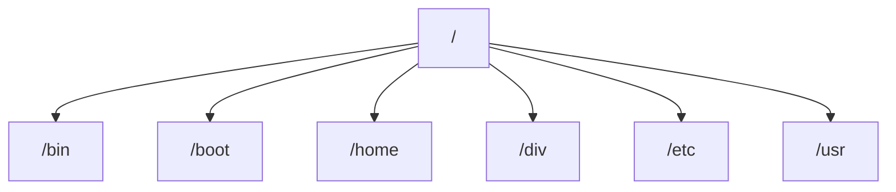

#coding #linux 
#### File System

- `/bin` - Stores all the program binaries 
- `/div` - Stores all the device drivers
- `/boot` - Contains all the boot-loader information
- `/home` - Contains all the user data (like Downloads, Documents, etc)
- `/usr` - Here lies all the required files to run application 
### Commands
- `ln -s <orginalfile> <linkedfile>` - Symlinks a original file to a linked file creating a dependency . 